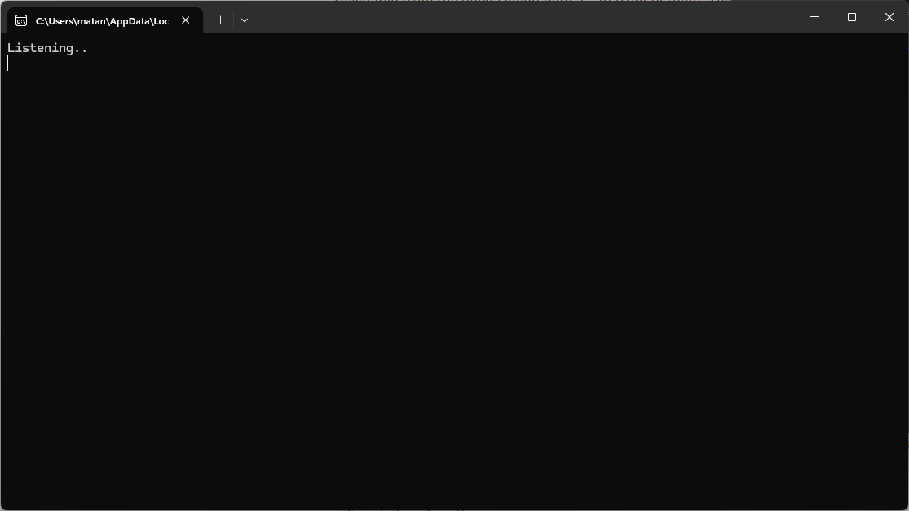
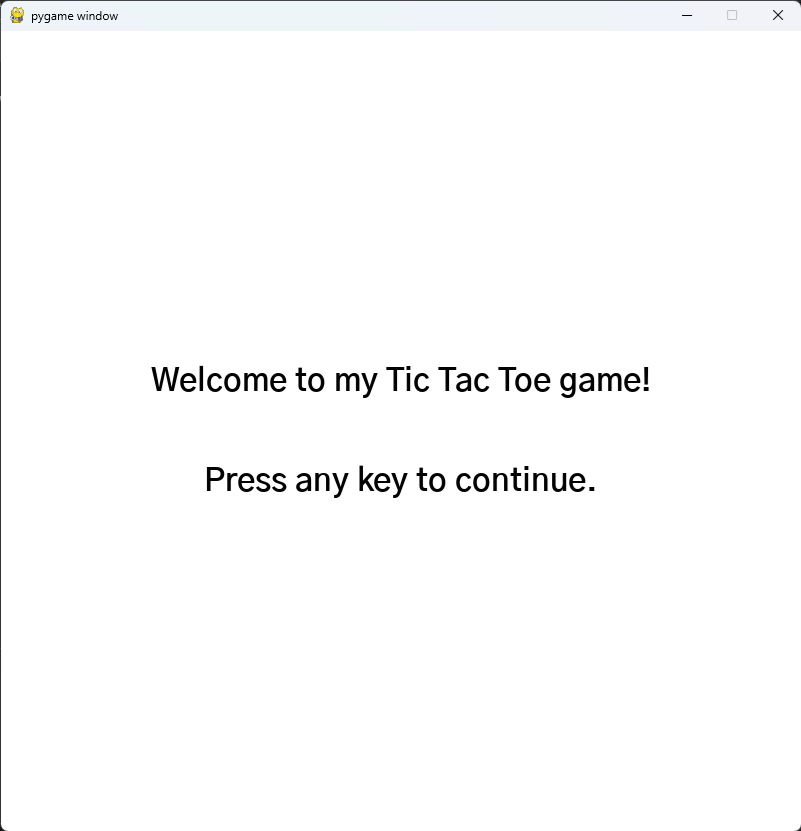
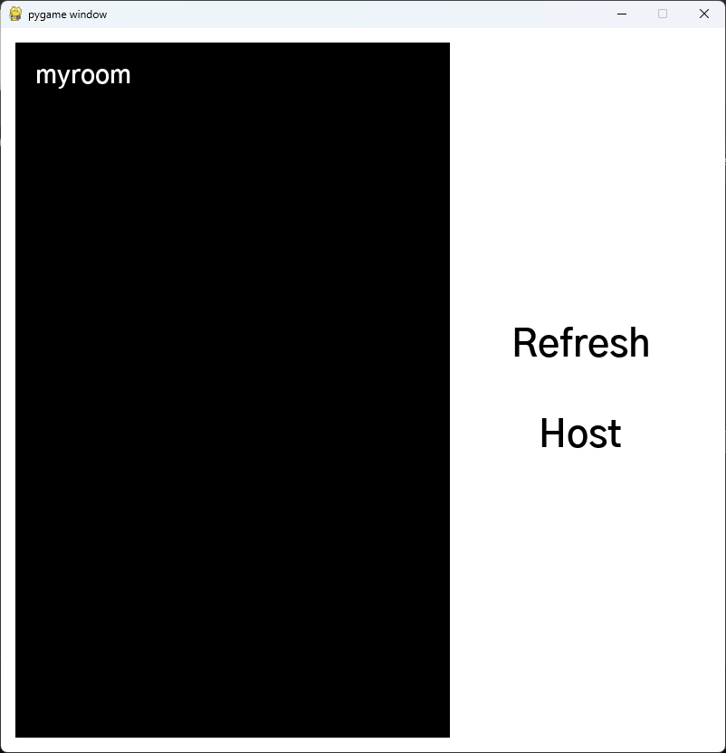
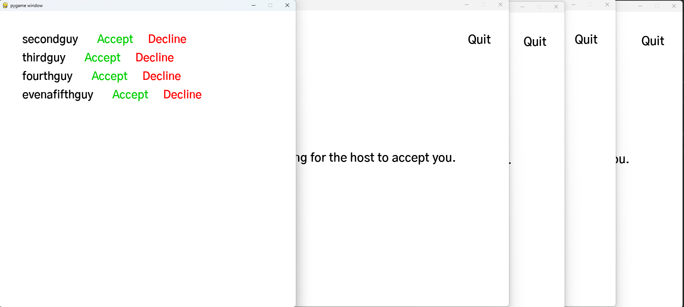
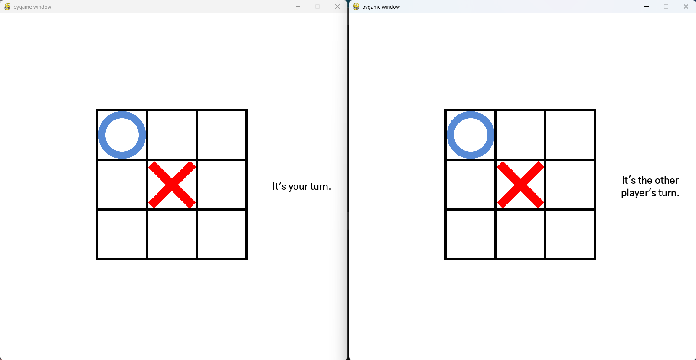
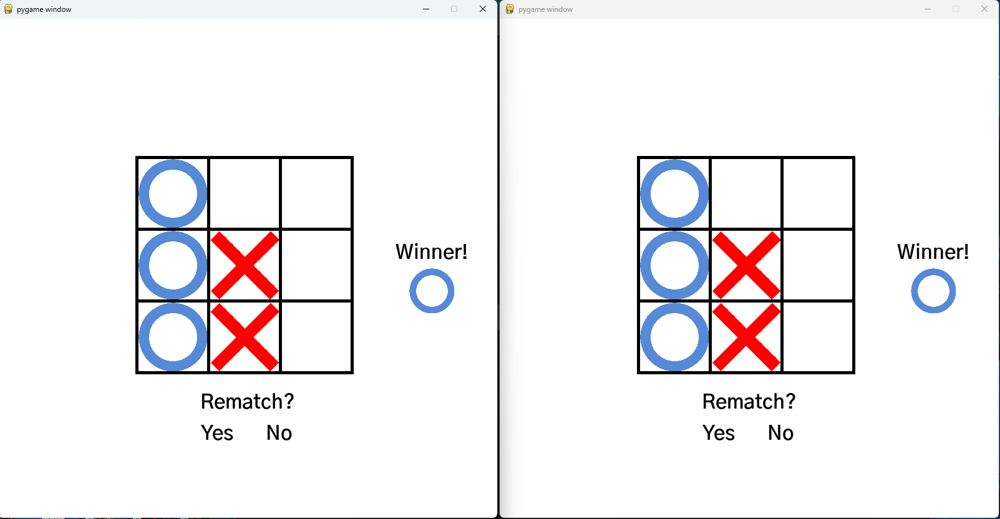
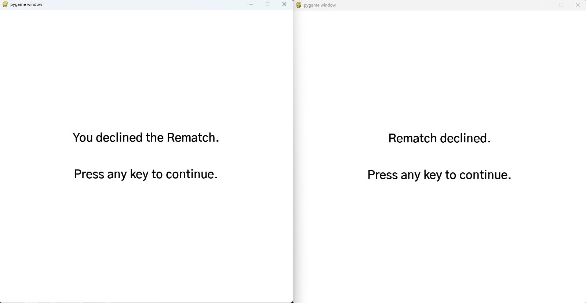

# TicTacToeMultiplayer
TicTacToeMultiplayer is a Multiplayer Tic Tac Toe game made in python with pygame.

## Usage:
You need to open up the ServerBrowserServer.py so the Users can connect to it and publicize their servers through it.
Make sure to open port 6010 on the Server Browser's Router if the Users are not local.

The Users can start the game by running MainMenu.py

## Screenshots

Opening the ServerBrowser:

Opening game (MainMenu.py):

Server Browser:

Multiple Players attempting to join it:

Game in Progress:

Game Won:

Rematch Declined:

There are also additional Screenshots in the `README Images` folder if you wish to see some details a bit more indepthly.
